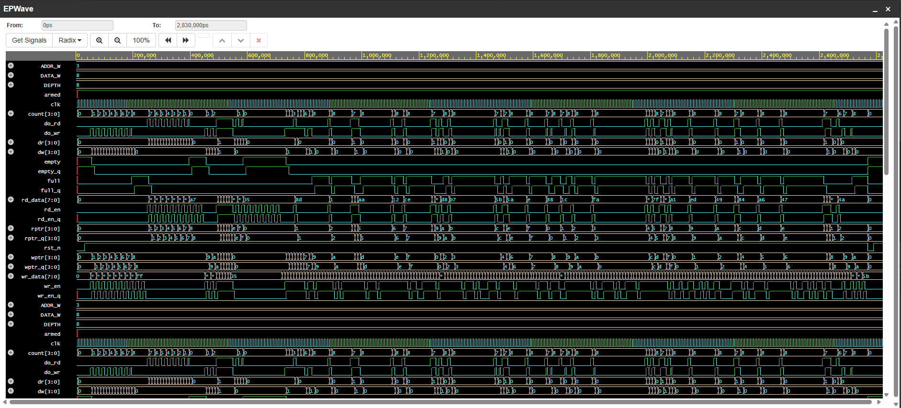

# Synchronous FIFO with Assertions (Verilog)

A parameterized synchronous FIFO written in Verilog, verified with a self-checking testbench
(directed tests + random traffic + reference-model scoreboard) and simulation-time assertions.

**Status:** all tests pass, 0 scoreboard errors, 0 assertion failures (Icarus Verilog, `-g2012`).

---

## 1. Features

- Parameters: `DATA_W` (data width) and `ADDR_W` (depth = `2^ADDR_W`)
- Single clock, active-low asynchronous reset
- Full / empty flags using the **extra-MSB pointer** technique
- Safe under misuse: writing when full and reading when empty are ignored (no data corruption)
- Simultaneous read and write supported
- Registered read data (valid one cycle after `rd_en`)

## 2. Port list

| Port | Dir | Width | Description |
|------|-----|-------|-------------|
| `clk` | in | 1 | Clock |
| `rst_n` | in | 1 | Active-low async reset |
| `wr_en` | in | 1 | Write request |
| `wr_data` | in | `DATA_W` | Data to write |
| `rd_en` | in | 1 | Read request |
| `rd_data` | out | `DATA_W` | Read data, valid the cycle after an accepted `rd_en` |
| `full` | out | 1 | FIFO holds `2^ADDR_W` entries |
| `empty` | out | 1 | FIFO holds 0 entries |

---

## 3. Code explanation (`rtl/sync_fifo.v`)

### 3.1 Storage and pointers

```verilog
reg [DATA_W-1:0] mem [0:DEPTH-1];
reg [ADDR_W:0]   wptr, rptr;
```

`mem` is the storage array. `wptr` is where the next write goes, `rptr` is where the next read
comes from. The pointers are **`ADDR_W+1` bits wide**, one bit more than needed to address the
memory. The lower `ADDR_W` bits index `mem`; the top bit is a "lap counter" that flips each time
the pointer wraps around the memory.

### 3.2 Why the extra bit? (full vs empty)

With only `ADDR_W`-bit pointers, `wptr == rptr` would mean *both* "empty" and "full", and you
couldn't tell them apart. The extra MSB fixes that:

```verilog
assign empty = (wptr == rptr);
assign full  = (wptr[ADDR_W] != rptr[ADDR_W]) &&
               (wptr[ADDR_W-1:0] == rptr[ADDR_W-1:0]);
```

- **Empty**: all bits equal. The write pointer has not gotten ahead of the read pointer.
- **Full**: the lower bits match (same memory location) but the MSBs differ. The write pointer
  has lapped the read pointer exactly once, so every slot is occupied.

Example with `ADDR_W = 3` (depth 8): after 8 writes, `wptr = 4'b1000` and `rptr = 4'b0000`.
Lower bits match, MSBs differ, so `full = 1`.

### 3.3 Guarding against overflow / underflow

```verilog
wire do_wr = wr_en && !full;
wire do_rd = rd_en && !empty;
```

The internal `do_wr` / `do_rd` signals are the *accepted* operations. If the user asserts
`wr_en` while the FIFO is full, `do_wr` stays 0 and nothing changes. Same for reads on empty.
This is what stops overflow and underflow from corrupting state.

### 3.4 The sequential block

```verilog
always @(posedge clk or negedge rst_n) begin
    if (!rst_n) begin
        wptr <= 0; rptr <= 0; rd_data <= 0;
    end else begin
        if (do_wr) begin
            mem[wptr[ADDR_W-1:0]] <= wr_data;
            wptr <= wptr + 1;
        end
        if (do_rd) begin
            rd_data <= mem[rptr[ADDR_W-1:0]];
            rptr <= rptr + 1;
        end
    end
end
```

- On reset both pointers go to 0, so the FIFO is empty.
- A write stores `wr_data` at the lower bits of `wptr`, then increments `wptr`.
- A read loads `mem[rptr]` into the **`rd_data` register**, then increments `rptr`. This is why
  read data appears one cycle after `rd_en`.
- The two `if` blocks are independent, so a read and a write in the same cycle both happen.
- Pointers wrap naturally: a `(ADDR_W+1)`-bit counter rolls over from all-ones to 0, and the MSB
  toggles each lap. No extra wrap logic is needed (depth must be a power of 2 for this reason).

### 3.5 Assertions (simulation only, wrapped in `ifndef SYNTHESIS`)

The assertions are immediate assertions inside a clocked block, checked every cycle. They use
"previous cycle" copies of the pointers and flags (`wptr_q`, `rptr_q`, `full_q`, ...).

| ID | What it checks | Bug it catches |
|----|----------------|----------------|
| A1 | `full` and `empty` are never both high | Broken flag logic |
| A2 | Occupancy `wptr - rptr` never exceeds `DEPTH` | Overflow / pointer corruption |
| A3 | `full` is high exactly when occupancy == `DEPTH` | Wrong full condition |
| A4 | `empty` is high exactly when occupancy == 0 | Wrong empty condition |
| A5 | `wptr` only moves if last cycle had `wr_en` and was not full | Write accepted while full |
| A6 | `rptr` only moves if last cycle had `rd_en` and was not empty | Read accepted while empty |
| A7 | Each pointer moves by at most 1 per cycle | Pointer jumps / double increment |

Note on A7: the pointer difference is computed in a `(ADDR_W+1)`-bit wire so that the natural
wrap-around (max value back to 0) is not mistaken for a big jump.

---

## 4. Testbench explanation (`tb/tb_sync_fifo.v`)

### 4.1 Structure

1. **DUT instance** with `DATA_W = 8`, `ADDR_W = 3` (depth 8, small so corners are hit quickly).
2. **Reference model** (always block): a simple array `ref_mem` with counters `m_w`, `m_r`,
   `m_cnt`. It applies the same rules as the FIFO (accept write if not full, accept read if not
   empty) using pre-edge occupancy, and records the data it *expects* to come out.
3. **Checker** (always block): waits 1 ns after each clock edge, then compares
   - `rd_data` against the model's expected data (when a read was accepted)
   - `full` against `m_cnt == DEPTH`
   - `empty` against `m_cnt == 0`
4. **Stimulus** (initial block): drives `push` / `pop` tasks and random traffic.

Inputs are driven on the **falling edge** of the clock so they are stable well before the
rising edge. This avoids race conditions between the testbench and the DUT.

### 4.2 Tests

| Test | Purpose |
|------|---------|
| T1 Reset state | `empty = 1`, `full = 0` after reset |
| T2 Fill + overflow | Write 8 entries, `full` must assert; 2 extra writes must be ignored |
| T3 Drain + underflow | Read all 8 back in order; `empty` must assert; 2 extra reads ignored |
| T4 Simultaneous read/write | Both `wr_en` and `rd_en` high for several cycles at mid occupancy |
| T5 Random traffic | 5000 cycles of random `wr_en`/`rd_en`/data, biased in phases to spend time near full and near empty |
| T6 Mid-operation reset | Reset with data inside; FIFO must come back empty |

### 4.3 Checking the checker

To make sure the testbench actually catches bugs, I injected a fault (removed the MSB comparison
from the `full` logic). The scoreboard reported thousands of mismatches and the run ended with
`RESULT: FAIL`. With the correct RTL: `Errors: 0`, `RESULT: PASS`.

---

## 5. Waveform



What to look for (captured from EPWave):

- **Fill:** `count` climbs 0 → 8, `wptr` increments each accepted write, and `full` goes high
  when `count` reaches 8.
- **Overflow attempts:** `wr_en` is still high but `wptr` stops moving and `count` stays at 8.
  The extra writes (`wr_data = ff`) are ignored.
- **Drain:** `rd_en` pulses, `rptr` increments, `count` falls 8 → 0, `rd_data` returns the stored
  values in order, and `empty` goes high.
- **Later section:** random traffic, with `full` and `empty` toggling as read/write pressure
  changes, and pointers wrapping around (`wptr`/`rptr` reaching `f` and rolling to `0`).

---

## 6. How to run

**Local (Icarus Verilog + GTKWave):**
```
sudo apt install iverilog gtkwave
bash sim/run.sh
gtkwave sim/fifo.vcd
```
Expected output ends with:
```
Cycles checked: 5078  Errors: 0
RESULT: PASS
```

**EDA Playground:** paste `rtl/sync_fifo.v` as the design, `tb/tb_sync_fifo.v` as the testbench,
select Icarus Verilog, add `-g2012` to compile options, and change the `$dumpfile` name to
`dump.vcd`.

## 7. Repository structure

```
sync-fifo-assertions/
├── rtl/sync_fifo.v        FIFO design + assertions
├── tb/tb_sync_fifo.v      testbench, scoreboard, directed + random tests
├── sim/run.sh             compile and run script
├── docs/waveform.png      simulation waveform
└── README.md
```

## 8. Limitations and possible extensions

- Depth must be a power of two (pointer wrap relies on it)
- Single clock domain only. A dual-clock version needs Gray-coded pointers and 2-flop
  synchronizers for clock-domain crossing
- Registered read (1-cycle latency); a first-word-fall-through variant is a possible extension
- Possible additions: almost-full / almost-empty flags, an `overflow`/`underflow` error output,
  SystemVerilog concurrent assertions (SVA) and functional coverage
